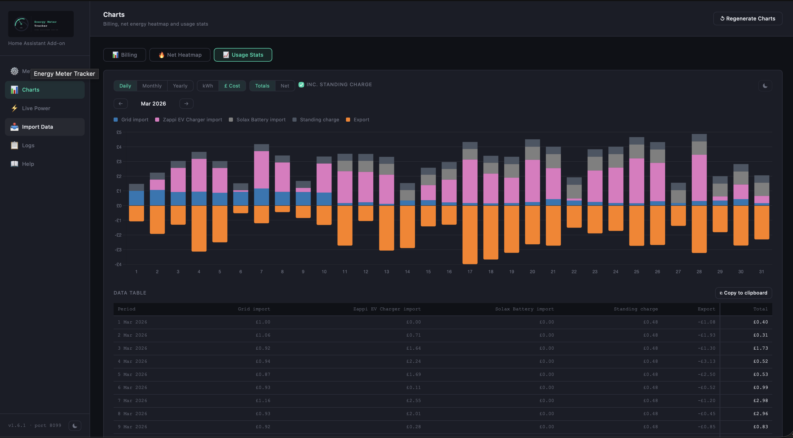
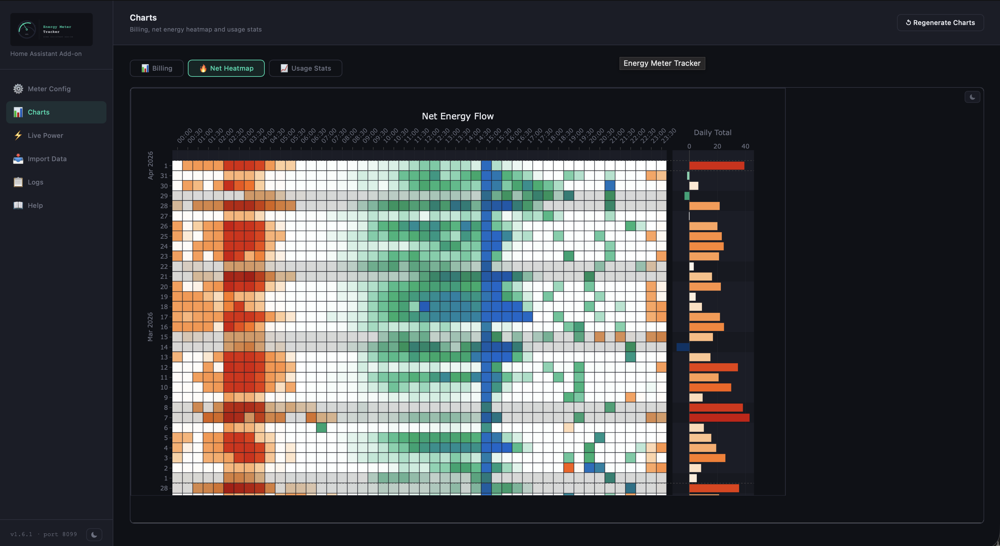
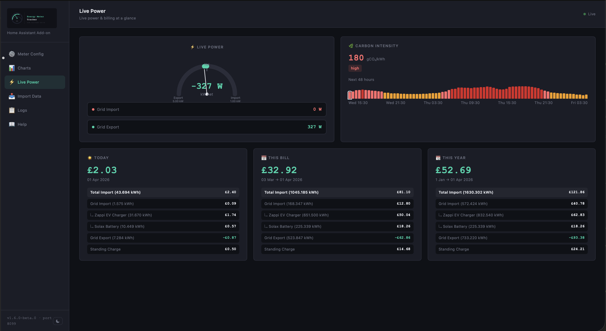

# Energy Meter Tracker

A Home Assistant add-on that records your electricity usage in precise configurable intervals — matching your energy supplier's meter reconciliation period for accurate billing.



## What it does

- Records import and export meter readings at configurable reconciliation period boundaries — 5, 15 or 30 minutes — matching your supplier's billing resolution
- Interpolates precisely to the boundary timestamp so block deltas are billing-accurate
- Tracks sub-meters (EV charger, home battery, heat pump) and distributes grid consumption across them
- Fills gaps automatically if the add-on restarts mid-session
- Publishes four cumulative sensors back to Home Assistant
- Serves a local web UI on port 8099 for configuration, charts, live power and data management

## What's new in 1.6.0

- **📈 Usage Stats chart** — new chart tab showing daily, monthly and yearly import/export with sub-meter breakdown in billing colours; switchable between kWh and cost; data table with copy-to-clipboard export
- **⚡ Live Power renamed** — the Summary page is now called Live Power throughout
- **Remember last page** — the add-on remembers which page and chart tab you were on and restores it on refresh
- **Mobile improvements** — heatmap pinch-zoom disabled, wider scroll strip, responsive height; help page collapsible sections; Usage Stats redraws correctly after device rotation

## Requirements

- A smart meter with a Consumer Access Device (CAD) publishing readings via MQTT to Home Assistant, updating at least every 60 seconds (10 seconds recommended)
- Cumulative kWh sensors for import and export
- Live rate sensors (£/kWh or local currency equivalent) for import and export tariffs
- Home Assistant OS, Supervised, or standalone Docker
- For correct local day assignment, configure your timezone in Meter Config (e.g. `Europe/London` for UK users)

## Installation

### HA OS / Supervised (recommended)

1. Add this repository to your Home Assistant add-on store
2. Install **Energy Meter Tracker**
3. Start the add-on and open the Web UI
4. Use the **Setup Wizard** to configure your main meter and sub-meters
5. Save — the engine will begin recording immediately

### Standalone Docker

If you run Home Assistant Container (plain Docker) without the Supervisor, clone the repo and build locally using the provided `Dockerfile.standalone`:

**Step 1 — Clone the repo**
```bash
git clone https://github.com/RGx01/energy-meter-tracker-addon.git
cd energy-meter-tracker-addon
```

**Step 2 — Create a data directory**
```bash
mkdir -p ~/emt-data
```

**Step 3 — Create a Long-Lived Access Token**

In your HA instance go to your profile → **Security → Long-Lived Access Tokens → Create Token**.

**Step 4 — Add to your docker-compose.yml**
```yaml
  energy-meter-tracker:
    build:
      context: ./energy-meter-tracker-addon
      dockerfile: Dockerfile.standalone
    container_name: energy-meter-tracker
    restart: unless-stopped
    ports:
      - "8099:8099"
    environment:
      - EMT_MODE=standalone
      - HA_URL=http://homeassistant:8123
      - LOG_LEVEL=info
      - HA_TOKEN=your_long_lived_access_token
    volumes:
      - ~/emt-data:/data/energy_meter_tracker
```

Replace `homeassistant` in `HA_URL` with your HA container service name, or use the host IP address if they are on different networks.

**Step 5 — Build and start**
```bash
docker-compose up -d --build energy-meter-tracker
```

Access the UI at `http://<host>:8099`.

> ⚠️ Ingress (sidebar embedding) is only available in HA OS/Supervised. In standalone mode access the UI directly at `http://<host>:8099`.

> ℹ️ Logs are written to `/data/energy_meter_tracker/addon.log` in standalone mode and are viewable from the **Logs** page in the UI.

**Optional — add to HA sidebar**

You can embed the UI in your HA sidebar using `panel_iframe` in your `configuration.yaml`:

```yaml
panel_iframe:
  energy_meter:
    title: "Energy Meter"
    icon: mdi:speedometer
    url: "http://192.168.1.x:8099"
```

Replace `192.168.1.x` with your Docker host IP. Restart HA after adding this.

## Web UI

Access the UI at `http://<your-ha-ip>:8099`

| Page | Description |
|------|-------------|
| Meter Config | Configure main meter, sub-meters, sensors, power sensor and postcode |
| Charts | Billing chart, net energy heatmap and usage stats |
| ⚡ Live Power | Live power gauge, billing cards and carbon intensity forecast |
| Import & Backup | Migrate data from a previous installation or restore a backup |
| Logs | Live add-on log viewer |
| Help | Full reference documentation |

## Charts

### Billing

The daily billing chart shows import, export and sub-meter consumption for each day, with accurate cost calculations matching the engine's billing logic. Billing periods, standing charges and rate changes are all handled correctly.

### Net Energy Heatmap

A half-hour heatmap showing net grid flow (import − export) for every reconciliation period. Colour-coded from red (import) through white to blue (export), making it easy to spot patterns — overnight EV charging, solar export windows, evening peaks.



### Usage Stats

Import and export broken down by day, month or year with sub-meter stacking. Switch between kWh and cost, and between Totals and Net views. A data table below the chart mirrors exactly what the chart shows, with a copy-to-clipboard button for exporting to Excel or Google Sheets.


## Live Power

The Live Power page appears in the sidebar once a **power sensor** is configured in Meter Config.



It provides:

- **Live power gauge** — shows net grid flow with asymmetric import/export scales derived from your usage history; colour reflects carbon intensity (UK) or import magnitude (global)
- **Billing cards** — Today, This Bill and This Year with full sub-meter breakdown; figures match the Billing chart exactly
- **Carbon intensity** (🇬🇧 UK only) — add your outward postcode prefix (e.g. `DE1`) in Meter Config to enable a 48-hour forecast strip from the National Grid API

### Configuring Live Power

In Meter Config → main meter card:

| Field | Description |
|-------|-------------|
| Power Sensor | Live power in kW — e.g. `sensor.smart_meter_electricity_power` |
| Postcode Prefix | 🇬🇧 UK only — outward postcode with district, e.g. `DE1`, `SW1A`, `M1` |

## Home Assistant Sensors

After each block finalises, four synthetic sensors are updated:

| Sensor | Description |
|--------|-------------|
| `sensor.energy_meter_import_kwh` | Cumulative grid import (kWh) |
| `sensor.energy_meter_export_kwh` | Cumulative grid export (kWh) |
| `sensor.energy_meter_import_cost` | Cumulative import cost |
| `sensor.energy_meter_export_credit` | Cumulative export credit |

These are compatible with the HA Energy dashboard and Utility Meter integrations.

## Data & Backup

### HA OS / Supervised

Data is stored in the add-on's private `/data/` directory, managed by the Supervisor. After every block finalise, all data files are also copied to `/share/energy_meter_tracker_backup/`. Zip snapshots are created automatically before every config save and are accessible from the Import & Backup page.

| Event | `/data/` | `/share/energy_meter_tracker_backup/` |
|-------|----------|---------------------------------------|
| Add-on update | ✅ Preserved | ✅ Preserved |
| HA restart | ✅ Preserved | ✅ Preserved |
| Add-on uninstall | ❌ **Wiped** | ✅ Preserved |

> ⚠️ **Uninstalling wipes `/data/`**. Always ensure a recent backup exists in `/share/` before uninstalling.

> ℹ️ There is no automatic pre-upgrade backup in supervised mode. Your most recent `/share` backup and the automatic zip before the last config save are your safety net. Create a manual backup before upgrading if you want extra assurance.

### Standalone Docker

The volume mount is **essential** — without it all data is lost when the container is recreated:

```bash
-v /path/to/data:/data/energy_meter_tracker
```

> ⚠️ **Before upgrading**, always create a manual backup from the Import & Backup page and copy it off the host.

## Disclaimer

Energy Meter Tracker is for informational use only. It cannot replicate your supplier's authoritative Half-Hourly reconciliation. Do not use this data for billing disputes or formal energy accounting.

## Supported Hardware

| Architecture | Supported |
|-------------|-----------|
| amd64 | ✅ |
| aarch64 | ✅ |
| armhf | ✅ |
| armv7 | ✅ |