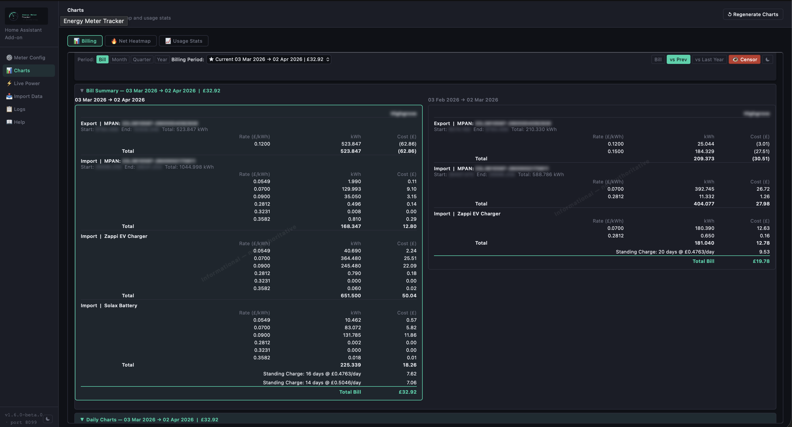
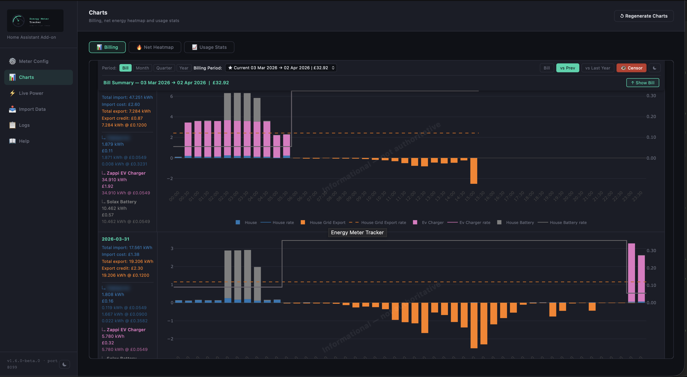
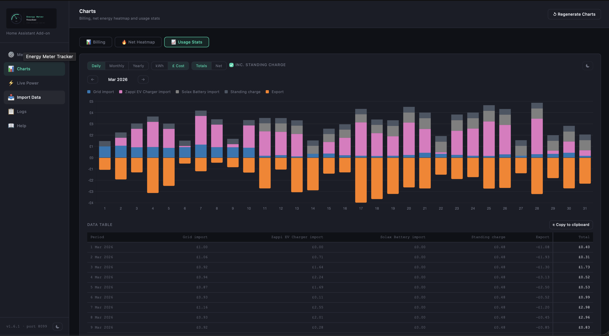
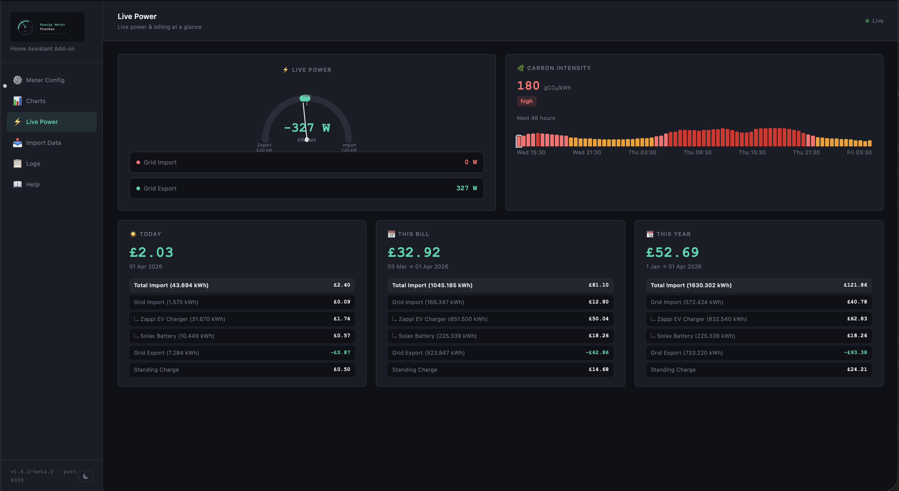

# Energy Meter Tracker

[![GitHub Release][releases-shield]][releases]
![Project Stage][project-stage-shield]
[![License][license-shield]](LICENSE)
[![Community Forum][forum-shield]][forum]
[![GitHub Activity][commits-shield]][commits]
![Project Maintenance][maintenance-shield]

![Supports aarch64 Architecture][aarch64-shield]
![Supports amd64 Architecture][amd64-shield]

[releases-shield]: https://img.shields.io/github/release/RGx01/energy-meter-tracker-addon.svg
[releases]: https://github.com/RGx01/energy-meter-tracker-addon/releases
[project-stage-shield]: https://img.shields.io/badge/project%20stage-production%20ready-brightgreen.svg
[license-shield]: https://img.shields.io/badge/license-BUSL--1.1-blue.svg
[forum-shield]: https://img.shields.io/badge/community-forum-informational.svg
[forum]: https://community.home-assistant.io/t/energy-meter-tracker/995674
[commits-shield]: https://img.shields.io/github/commit-activity/y/RGx01/energy-meter-tracker-addon.svg
[commits]: https://github.com/RGx01/energy-meter-tracker-addon/commits/main
[maintenance-shield]: https://img.shields.io/maintenance/yes/2026.svg
[aarch64-shield]: https://img.shields.io/badge/aarch64-yes-green.svg
[amd64-shield]: https://img.shields.io/badge/amd64-yes-green.svg

A Home Assistant add-on that records your electricity usage in precise configurable intervals — matching your energy supplier's meter reconciliation period for accurate billing.




## What it does

- Records import and export meter readings at configurable reconciliation period boundaries — 5, 15 or 30 minutes — matching your supplier's billing resolution
- Interpolates precisely to the boundary timestamp so block deltas are billing-accurate
- Tracks sub-meters (EV charger, home battery, heat pump) and distributes grid consumption across them
- Fills gaps automatically if the add-on restarts mid-session
- Publishes four cumulative sensors back to Home Assistant
- Serves a local web UI on port 8099 for configuration, charts, insights, live power and data management
- Records grid carbon intensity at every block (🇬🇧 UK, postcode required) for per-period carbon accounting
- Carbon Insights: house consumption, solar offset, EV mileage and gCO₂/mile, battery charging behaviour, heat pump vs gas comparison

## What's new in 2.7.0

- **⚡ Live Power — sub-meter cards** — battery, EV charger and heat pump sub-meters now show dedicated cards on the Live Power page. Battery cards show SoC with a colour-coded icon (green/amber/red) and a bidirectional inverter gauge (teal = discharging, purple = charging). EV charger cards show a unidirectional charge gauge with V2X support. Heat pump cards show a power gauge.

- **Meter Type** — sub-meters now have an explicit type field (🔋 Battery / 🚗 EV Charger / ♨️ Heat Pump) in Settings → Meter Config. Setting the type unlocks the contextual sensor fields needed for Live Power cards. **Meter type is permanent once data has been recorded** — choose carefully.

- **More reliable restarts** — the engine now waits for all configured sensors to report before starting, and fetches carbon intensity data before gap filling. Gap fill blocks now carry correct rates, standing charges and carbon intensity rather than zeroes.

- **Standing charge BST fix** — users in BST (UTC+1) may see corrected standing charge figures for some historical days in the billing chart and Usage Stats. This is correct data, not a regression.

- **Sub-meter cascade delete** — removing a sub-meter from config now permanently deletes all its historical block data. A confirmation prompt makes this clear before proceeding.

- **Delete Blocks time pickers** — the Delete Blocks page now accepts from/to times (local time) in addition to dates, allowing precise block removal within a single day.

### Upgrading to 2.7.0 — action required

**Existing users** need to set the Meter Type for each sub-meter before the new Live Power cards will appear. The type dropdown is available for existing meters that don't yet have a type set — once set and saved it locks permanently.

1. Go to **Settings → Meter Config**
2. Open each device card
3. Select the correct type from the **Meter Type** dropdown (🔋 Battery / 🚗 EV Charger / ♨️ Heat Pump)
4. Configure the sensor fields that appear (SoC sensor, inverter power sensor etc.)
5. Save — the Live Power page will reload and show the new cards

> ⚠️ Meter type locks permanently once set and data has been recorded. If you set the wrong type you must use **Add Device** to add a replacement, then delete the incorrectly typed device and all its data.

## Requirements

- A smart meter with a Consumer Access Device (CAD) publishing readings via MQTT to Home Assistant, updating at least every 60 seconds (10 seconds recommended)
- Cumulative kWh sensors for import and export
- Live rate sensors (£/kWh or local currency equivalent) for import and export tariffs
- Home Assistant OS, Supervised, or standalone Docker
- For correct local day assignment, configure your timezone in Meter Config (e.g. `Europe/London` for UK users)

## Installation

### HA OS / Supervised (recommended)

1. Add this repository to your Home Assistant add-on store
2. Install **Energy Meter Tracker**
3. Start the add-on and open the Web UI
4. Use the **Setup Wizard** to configure your main meter and sub-meters
5. Save — the engine will begin recording immediately

### Standalone Docker

If you run Home Assistant Container (plain Docker) without the Supervisor, clone the repo and build locally using the provided `Dockerfile.standalone`:

**Step 1 — Clone the repo**
```bash
git clone https://github.com/RGx01/energy-meter-tracker-addon.git
cd energy-meter-tracker-addon
```

**Step 2 — Create a data directory**
```bash
mkdir -p ~/emt-data
```

**Step 3 — Create a Long-Lived Access Token**

In your HA instance go to your profile → **Security → Long-Lived Access Tokens → Create Token**.

**Step 4 — Add to your docker-compose.yml**
```yaml
  energy-meter-tracker:
    build:
      context: ./energy-meter-tracker-addon
      dockerfile: Dockerfile.standalone
    container_name: energy-meter-tracker
    restart: unless-stopped
    ports:
      - "8099:8099"
    environment:
      - EMT_MODE=standalone
      - HA_URL=http://homeassistant:8123
      - LOG_LEVEL=info
      - HA_TOKEN=your_long_lived_access_token
    volumes:
      - ~/emt-data:/data/energy_meter_tracker
```

Replace `homeassistant` in `HA_URL` with your HA container service name, or use the host IP address if they are on different networks.

**Step 5 — Build and start**
```bash
docker-compose up -d --build energy-meter-tracker
```

Access the UI at `http://<host>:8099`.

> ⚠️ Ingress (sidebar embedding) is only available in HA OS/Supervised. In standalone mode access the UI directly at `http://<host>:8099`.

> ℹ️ Logs are written to `/data/energy_meter_tracker/addon.log` in standalone mode and are viewable from the **Logs** page in the UI.

**Optional — add to HA sidebar**

You can embed the UI in your HA sidebar using `panel_iframe` in your `configuration.yaml`:

```yaml
panel_iframe:
  energy_meter:
    title: "Energy Meter"
    icon: mdi:speedometer
    url: "http://192.168.1.x:8099"
```

Replace `192.168.1.x` with your Docker host IP. Restart HA after adding this.

## Web UI

Access the UI at `http://<your-ha-ip>:8099`

| Page | Description |
|------|-------------|
| ⚙️ Settings | Meter Config tab (main meter, sub-meters, sensors, postcode) and Carbon tab (assumption overrides for insights calculations) |
| 📊 Charts | Billing chart, net energy heatmap and usage stats |
| 🌿 Insights | Carbon analysis by billing period — house consumption, solar offset, EV mileage, battery behaviour, heat pump vs gas |
| ⚡ Live Power | Live power gauge, billing cards and carbon intensity forecast |
| 🗄️ Data Management | Backups, restore, historical corrections and block deletion |
| 📋 Logs | Live add-on log viewer |
| 📖 Help | Full reference documentation and links to the GitHub wiki |

## Charts

### Billing

The daily billing chart shows import, export and sub-meter consumption for each day, with accurate cost calculations matching the engine's billing logic. Billing periods, standing charges and rate changes are all handled correctly. If your billing day has changed, each period uses the billing day that was active at the time.

### Net Energy Heatmap

A half-hour heatmap showing net grid flow (import − export) for every reconciliation period. Colour-coded from red (import) through white to blue (export), making it easy to spot patterns — overnight EV charging, solar export windows, evening peaks.


### Usage Stats

Import and export broken down by day, month or year with sub-meter stacking. Switch between kWh and cost, and between Totals and Net views. A data table below the chart mirrors exactly what the chart shows, with a copy-to-clipboard button for exporting to Excel or Google Sheets.

Billing mode groups data by your billing periods (respecting billing day changes). Calendar mode groups by calendar month.



## Insights

The Insights page surfaces per-block carbon data as meaningful narrative cards, organised by billing period.

### Carbon Summary
Net kgCO₂ for the period, your effective intensity vs the grid average, import/export split, and relatable equivalences (car miles, tree days, flight percentage). A trend chart shows net carbon across all billing periods — click any bar to navigate to that period.

### House Consumption (direct from grid)
Grid import attributable to the house, excluding EV and battery charging sub-meters. Carbon and kWh shown are from blocks with recorded carbon intensity only — coverage percentage is displayed when below 95%.

### Solar Export Offset
Carbon displaced by your export, calculated using the actual grid intensity at the time of each export block.

### Battery Charging Behaviour
Whether your battery preferentially charged during cleaner grid periods. Shows average charge intensity vs grid average and estimated carbon saving. Honest note: export cannot be split between solar and battery without generation-side metering.

### Heat Pump
Estimated heat delivered (electricity × SCOP), carbon cost vs equivalent gas boiler, % cleaner, and the crossover grid intensity above which gas would be cleaner. In the UK the grid rarely reaches this threshold.

### EV Charging
AC from grid, usable DC stored (after charge efficiency loss), average charge intensity, estimated mileage and gCO₂/mile vs petrol. Carbon and kWh are from CI-covered blocks only.

### Carbon data coverage
Carbon intensity has been recorded since you added a postcode prefix to Meter Config. Blocks before that date show zero coverage. As history accumulates, coverage improves and comparisons become more reliable.

---

## Live Power

The Live Power page appears in the sidebar once a **power sensor** is configured in Meter Config.



It provides:

- **Live power gauge** — shows net grid flow with asymmetric import/export scales derived from your usage history; colour reflects carbon intensity (UK) or import magnitude (global)
- **Sub-meter cards** — battery, EV charger and heat pump sub-meters show dedicated cards with live gauges once a Meter Type and sensors are configured in Settings → Meter Config
- **Billing cards** — Today, This Bill and This Year with full sub-meter breakdown; figures match the Billing chart exactly; This Bill uses your billing history to show the correct period even if your billing day has changed
- **Carbon intensity** (🇬🇧 UK only) — add your outward postcode prefix (e.g. `DE1`) in Meter Config to enable a 48-hour forecast strip from the National Grid API

### Configuring Live Power

In Meter Config → main meter card:

| Field | Description |
|-------|-------------|
| Power Sensor | Live power in kW — e.g. `sensor.smart_meter_electricity_power` |
| Postcode Prefix | 🇬🇧 UK only — outward postcode with district, e.g. `DE1`, `SW1A`, `M1` |

## Billing History

The Billing History page records when your billing configuration changed. Access it via the **🕓 Billing History** button on the Meter Config page.

Use **New Period** when you:
- Move address
- Change energy supplier
- Change your billing day
- Add or change meters

Each period stores the billing day, timezone, currency, site name and a freetext change reason. Billing charts always use the config that was active when each block was recorded, so historical figures remain accurate after any change.

### Period transitions

When you add a new period, the previous period's final billing cycle is **truncated** at the transition date — it cannot be extended. If your billing day changes from the 3rd to the 15th and you set the effective date to the 10th, your last bill under the old config runs from the 3rd to the 14th, and your first bill under the new config starts on the 15th.

### Removing periods

When 2 or more periods exist, any period can be removed. Blocks from the removed period are reassigned to the previous (older) period. If you remove the active (most recent) period, the previous period becomes active again.

## Home Assistant Sensors

After each block finalises, four synthetic sensors are updated:

| Sensor | Description |
|--------|-------------|
| `sensor.energy_meter_import_kwh` | Cumulative grid import (kWh) |
| `sensor.energy_meter_export_kwh` | Cumulative grid export (kWh) |
| `sensor.energy_meter_import_cost` | Cumulative import cost |
| `sensor.energy_meter_export_credit` | Cumulative export credit |

These are compatible with the HA Energy dashboard and Utility Meter integrations.

## Data & Backup

### Storage

All blocks are stored in a SQLite database (`blocks.db`) in the add-on's data directory. After every block finalise, the database and config are also copied to `/share/energy_meter_tracker_backup/`. Zip snapshots are created automatically before every config save and are accessible from the Data Management page.

| Event | `/data/` | `/share/energy_meter_tracker_backup/` |
|-------|----------|---------------------------------------|
| Add-on update | ✅ Preserved | ✅ Preserved |
| HA restart | ✅ Preserved | ✅ Preserved |
| Add-on uninstall | ❌ **Wiped** | ✅ Preserved |

> ⚠️ **Uninstalling wipes `/data/`**. Always ensure a recent backup exists in `/share/` before uninstalling.

> ℹ️ There is no automatic pre-upgrade backup in supervised mode. Your most recent `/share` backup and the automatic zip before the last config save are your safety net. Create a manual backup from the Data Management page before upgrading if you want extra assurance.

### Migrating from 1.x

If you are upgrading from a version that used `blocks.json`, the add-on will automatically migrate your data to SQLite on first start. The original `blocks.json` is preserved. Migration typically takes a few seconds for a year of 5-minute blocks.

### Standalone Docker

The volume mount is **essential** — without it all data is lost when the container is recreated:

```bash
-v /path/to/data:/data/energy_meter_tracker
```

> ⚠️ **Before upgrading**, always create a manual backup from the Data Management page and copy it off the host.

## Supported Hardware

| Architecture | Supported |
|---|---|
| amd64 | ✅ |
| aarch64 | ✅ |

## Documentation & Support

- 📖 [GitHub Wiki](https://github.com/RGx01/energy-meter-tracker-addon/wiki) — sensor requirements, integration guides, known limitations
- 🐛 [GitHub Issues](https://github.com/RGx01/energy-meter-tracker-addon/issues) — bug reports and feature requests
- 💬 [Community Forum](https://community.home-assistant.io/t/energy-meter-tracker/995674) — discussion and help

## Disclaimer

Energy Meter Tracker is for informational use only. It cannot replicate your supplier's authoritative Half-Hourly reconciliation. Do not use this data for billing disputes or formal energy accounting.