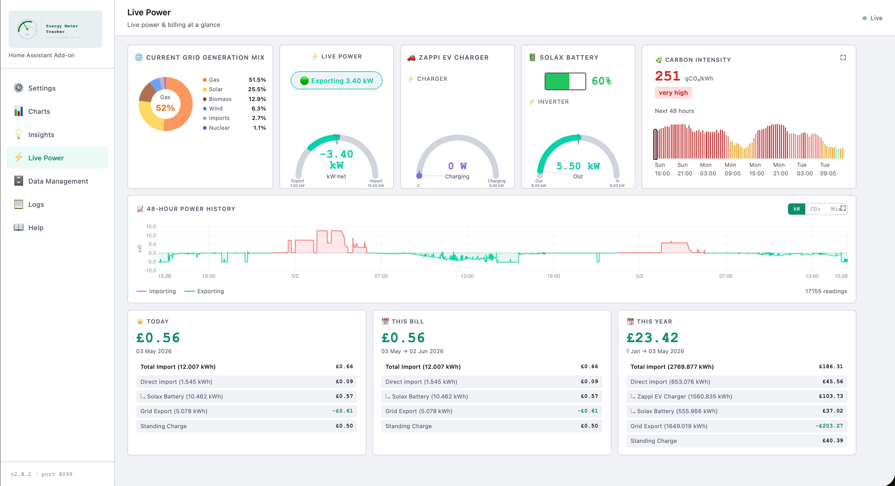
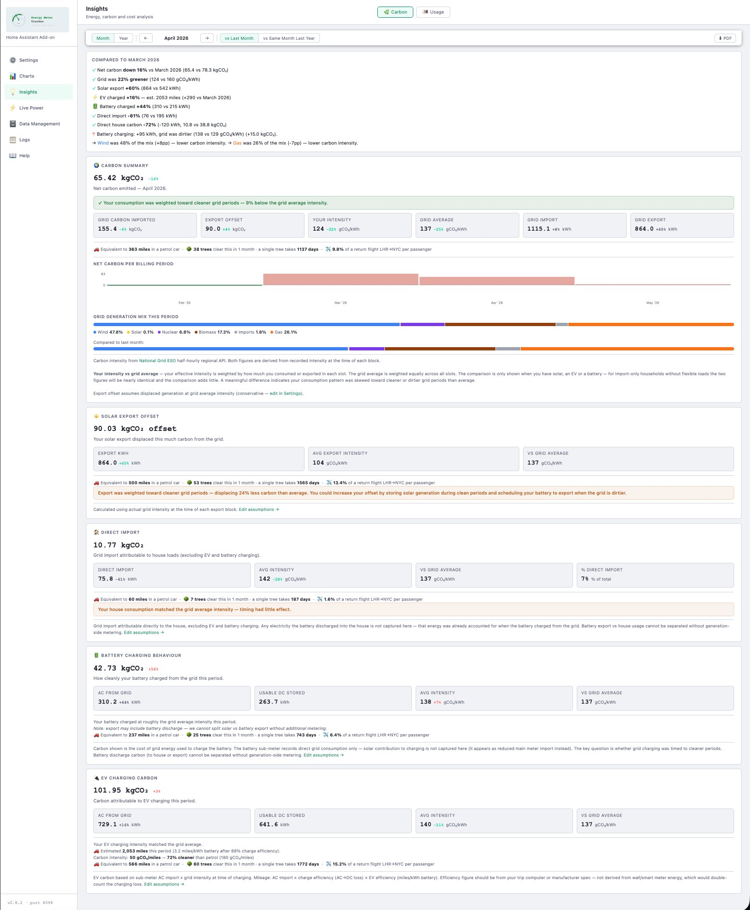
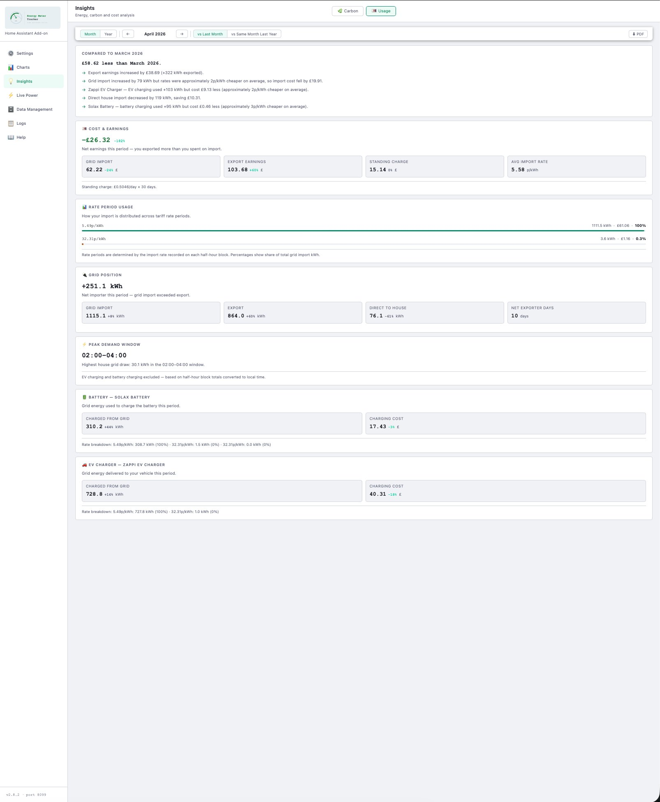
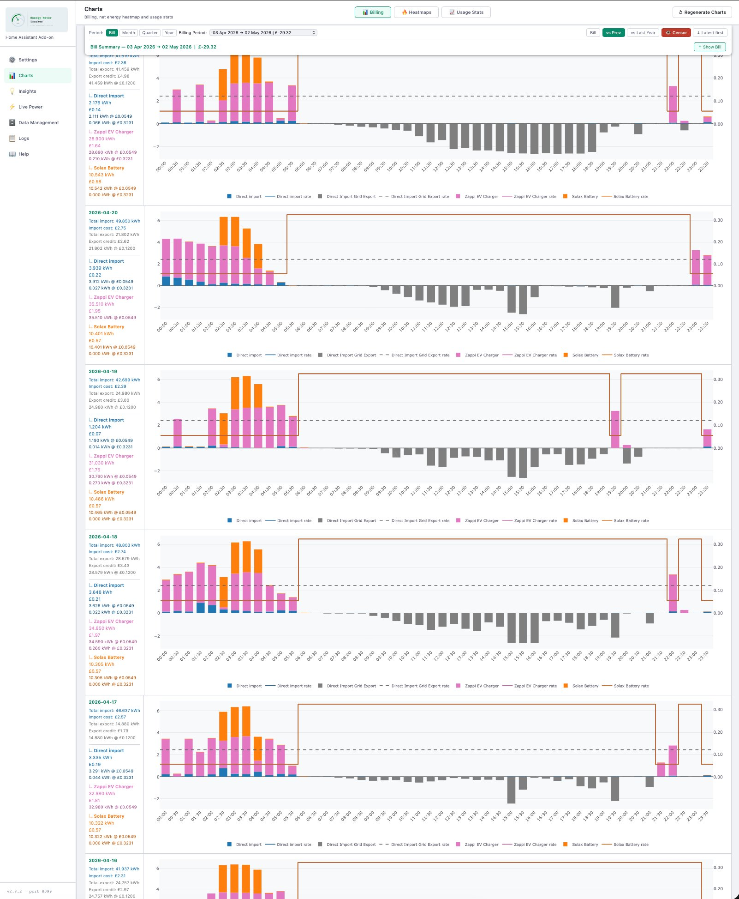
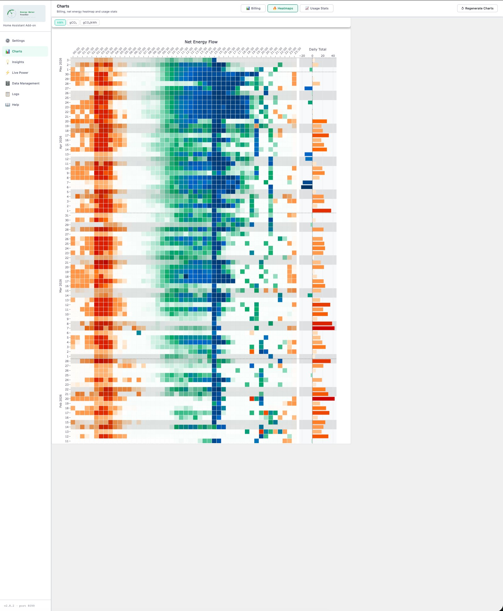
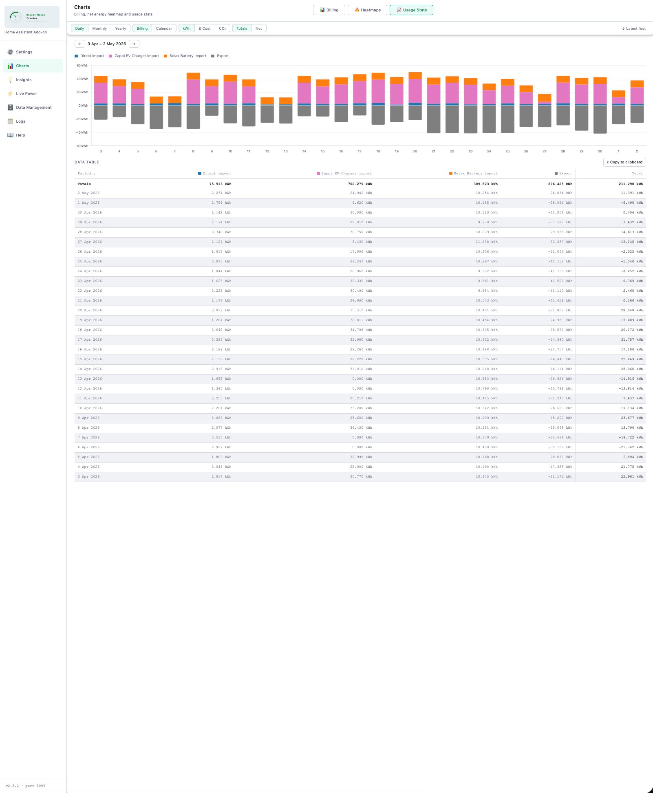

# Energy Meter Tracker

[![GitHub Release][releases-shield]][releases]
![Project Stage][project-stage-shield]
[![License][license-shield]](LICENSE)
[![Community Forum][forum-shield]][forum]
[![GitHub Activity][commits-shield]][commits]
![Project Maintenance][maintenance-shield]

![Supports aarch64 Architecture][aarch64-shield]
![Supports amd64 Architecture][amd64-shield]

[releases-shield]: https://img.shields.io/github/release/RGx01/energy-meter-tracker-addon.svg
[releases]: https://github.com/RGx01/energy-meter-tracker-addon/releases
[project-stage-shield]: https://img.shields.io/badge/project%20stage-production%20ready-brightgreen.svg
[license-shield]: https://img.shields.io/badge/license-BUSL--1.1-blue.svg
[forum-shield]: https://img.shields.io/badge/community-forum-informational.svg
[forum]: https://community.home-assistant.io/t/energy-meter-tracker/995674
[commits-shield]: https://img.shields.io/github/commit-activity/y/RGx01/energy-meter-tracker-addon.svg
[commits]: https://github.com/RGx01/energy-meter-tracker-addon/commits/main
[maintenance-shield]: https://img.shields.io/maintenance/yes/2026.svg
[aarch64-shield]: https://img.shields.io/badge/aarch64-yes-green.svg
[amd64-shield]: https://img.shields.io/badge/amd64-yes-green.svg

A Home Assistant add-on that records your electricity usage in precise configurable intervals — matching your energy supplier's meter reconciliation period for accurate billing.

<table>
  <tr>
    <td align="center" width="33%">
      <a href="screenshots/live-power.png">
        <br>
        <sub><b>Live Power</b></sub>
      </a>
    </td>
    <td align="center" width="33%">
      <a href="screenshots/carbon-insights.png">
        <br>
        <sub><b>Carbon Insights</b></sub>
      </a>
    </td>
    <td align="center" width="33%">
      <a href="screenshots/usage-insights.png">
        <br>
        <sub><b>Usage Insights</b></sub>
      </a>
    </td>
  </tr>
  <tr>
    <td align="center" width="33%">
      <a href="screenshots/billing-chart.png">
        <br>
        <sub><b>Billing Chart</b></sub>
      </a>
    </td>
    <td align="center" width="33%">
      <a href="screenshots/heatmap.png">
        <br>
        <sub><b>Net Energy Heatmap</b></sub>
      </a>
    </td>
    <td align="center" width="33%">
      <a href="screenshots/usage-stats-totals.png">
        <br>
        <sub><b>Usage Stats</b></sub>
      </a>
    </td>
  </tr>
</table>

---

## What it does

- Records import and export meter readings at configurable reconciliation period boundaries — 5, 15 or 30 minutes — matching your supplier's billing resolution
- Interpolates precisely to the boundary timestamp so block deltas are billing-accurate
- Tracks sub-meters (EV charger, home battery, heat pump) and distributes grid consumption across them
- Fills gaps automatically if the add-on restarts mid-session
- Publishes four cumulative sensors back to Home Assistant, compatible with the HA Energy dashboard
- Serves a local web UI on port 8099 for configuration, charts, insights, live power and data management
- Records grid carbon intensity at every block (🇬🇧 UK, postcode required) for per-period carbon accounting
- **Carbon Insights** — house consumption, solar offset, EV mileage and gCO₂/mile, battery charging behaviour, heat pump vs gas comparison, grid generation mix breakdown
- **Usage Insights** — cost breakdown by meter, rate period distribution, grid position, peak demand window, per-device costs with period comparison narrative in plain English
- Exports any chart tab as a PDF report — Billing (with per-day data tables and billing summary), Heatmaps, and Usage Stats

---

## 📖 Documentation

Full documentation is on the **[GitHub Wiki](https://github.com/RGx01/energy-meter-tracker-addon/wiki)**:

| | |
|---|---|
| [Installation and Setup](https://github.com/RGx01/energy-meter-tracker-addon/wiki/Installation-and-Setup) | Installing, first run, Setup Wizard |
| [Configuring Meters](https://github.com/RGx01/energy-meter-tracker-addon/wiki/Configuring-Meters) | Main meter, sub-meters, sensors |
| [Managing Billing Periods](https://github.com/RGx01/energy-meter-tracker-addon/wiki/Managing-Billing-Periods) | Config history, tariff changes |
| [Live Power](https://github.com/RGx01/energy-meter-tracker-addon/wiki/Live-Power) | Gauges, billing cards, generation mix |
| [Charts](https://github.com/RGx01/energy-meter-tracker-addon/wiki/Charts) | Billing chart, heatmap, usage stats |
| [Insights](https://github.com/RGx01/energy-meter-tracker-addon/wiki/Insights) | Carbon and Usage analysis, PDF export |
| [Data Management](https://github.com/RGx01/energy-meter-tracker-addon/wiki/Data-Management) | Backups, restore, corrections |
| [Sensor Requirements](https://github.com/RGx01/energy-meter-tracker-addon/wiki/Sensor-Requirements-and-Known-Limitations) | Sensor types, units, known limitations |
| [Carbon Intensity](https://github.com/RGx01/energy-meter-tracker-addon/wiki/Carbon-Intensity) | How carbon data is fetched and used |

---

## What's new in 2.10

### 2.10.0
- **📋 Per-day data table** — expand any day on the Billing chart to see a half-hourly breakdown of import, export, direct import and per-device kWh and cost. Toggle all tables open/closed at once with the **Show Data / Hide Data** button in the floating toolbar. State persists across the 2-minute auto-refresh.
- **⬇ PDF export** — export any chart tab as a print-ready report. Billing exports capture the current period, view (Bill / vs Prev / vs Last Year), billing summary, daily chart images and any open data tables. Heatmap and Usage Stats tabs export the chart image, toolbar state and data table. Open via the ⬇ PDF button in the topbar.
- **Sub-meter boundary interpolation** — provisional blocks are retrospectively corrected when the first post-boundary read arrives, eliminating up to ~0.12 kWh per-boundary misalignment at 7.4 kW without affecting period totals.
- **Rounding fixes** — billing summary period totals, usage stats totals row, and Live Power billing card headlines now always agree exactly with the sum of their displayed line items.
- **Bug fixes** — Grid Export legend label, daily chart iframe blank on year view (WebKit size limit), Direct Import kWh attribution, device kWh grid-only consistency.

---

## What's new in 2.9

### 2.9.0
- **📦 Device retirement** — archive a sub-meter without deleting its history. Use the new **Archive** button on any sub-meter card in Settings → Meter Config. The device stops recording, disappears from Live Power, and its sensor entity IDs are freed for reuse. All historical blocks are preserved and still appear in charts and insights. Retirement can be reversed via **↩ Unretire**.
- **⏱ 12-hour gap-fill limit** — gaps longer than 12 hours are no longer gap-filled. Previously EMT would interpolate across any gap length, producing misleading data for extended CAD or HA outages. Short gaps (power cuts, brief restarts) still gap-fill as before.
- **⚠️ Meter reset advisory** — when a gap exceeds 12 hours and the post-gap import read is significantly lower than before, EMT shows an advisory banner suggesting you create a new billing period. Covers meter replacement and moving to a new property.
- **PDF fix** — Usage Insights PDF no longer shows the carbon comparison narrative at the top of the report.

---

## What's new in 2.8

### 2.8.2
- **PDF export fixes** — Carbon report no longer duplicates the comparison panel; Usage report correctly excludes hidden cards when no comparison period is selected

### 2.8.1
- **Favicon** — browser tab now shows the EMT icon
- **Timezone auto-detect** — Setup Wizard pre-fills timezone from your browser
- **PDF export** — ⬇ PDF button on Insights toolbar opens a clean printable report in a new tab with logo, period, version and full tab content
- **Generation mix history** — 48-hour mix chart now updates at CI-tick resolution (~15 min) independently of block size, so it stays current on 30-minute block installations
- **Usage Stats Net view** — data table now shows Import and Export as separate columns with Total = Import − Export
- **Gauge arc light theme** — gauge background arcs now correctly render in light theme
- **Charts period recall** — selected billing period is now restored correctly when returning to the Charts page

### 2.8.0
- **💡 Usage Insights** — new Usage tab alongside Carbon showing cost breakdown, rate period distribution, grid position, peak demand window and per-device costs. Period comparison narrative explains cost drivers in plain English
- **🌐 Current Grid Generation Mix** — donut chart on Live Power showing the current half-hour's fuel split. 🇬🇧 UK only
- **⚡ 48-Hour Generation Mix chart** — third mode (kW / CO₂ / Mix) on the 48-hour power history chart. 🇬🇧 UK only
- **Generation mix in Carbon Insights** — stacked bar showing the period's imp_kwh-weighted fuel mix with comparison bar and narrative
- **Billing chart performance** — JavaScript parsing reduced from 5.8 MB → 76 KB (77×). Charts load near-instantly on slow devices
- **Timezone refactor** — local date columns dropped from the database; all queries compute UTC bounds at query time

---

## Requirements

- A smart meter with a Consumer Access Device (CAD) or integration providing cumulative kWh readings, updating at least every 60 seconds (10 seconds recommended)
- Cumulative kWh sensors for import and export
- Live rate sensors (£/kWh or local currency equivalent) for import and export tariffs
- Home Assistant OS, Supervised, or standalone Docker

See [Sensor Requirements and Known Limitations](https://github.com/RGx01/energy-meter-tracker-addon/wiki/Sensor-Requirements-and-Known-Limitations) for full details.

---

## Installation

### HA OS / Supervised (recommended)

[](https://my.home-assistant.io/redirect/supervisor_add_addon_repository/?repository_url=https%3A%2F%2Fgithub.com%2FRGx01%2Fenergy-meter-tracker-addon)

1. Add this repository to your Home Assistant add-on store
2. Install **Energy Meter Tracker**
3. Start the add-on and open the Web UI
4. Use the **Setup Wizard** to configure your main meter and sub-meters
5. Save — the engine will begin recording immediately

### Standalone Docker

If you run Home Assistant Container (plain Docker) without the Supervisor, clone the repo and build locally using the provided `Dockerfile.standalone`:

**Step 1 — Clone the repo**
```bash
git clone https://github.com/RGx01/energy-meter-tracker-addon.git
cd energy-meter-tracker-addon
```

**Step 2 — Create a data directory**
```bash
mkdir -p ~/emt-data
```

**Step 3 — Create a Long-Lived Access Token**

In your HA instance go to your profile → **Security → Long-Lived Access Tokens → Create Token**.

**Step 4 — Add to your docker-compose.yml**
```yaml
  energy-meter-tracker:
    build:
      context: ./energy-meter-tracker-addon
      dockerfile: Dockerfile.standalone
    container_name: energy-meter-tracker
    restart: unless-stopped
    ports:
      - "8099:8099"
    environment:
      - EMT_MODE=standalone
      - HA_URL=http://homeassistant:8123
      - LOG_LEVEL=info
      - HA_TOKEN=your_long_lived_access_token
    volumes:
      - ~/emt-data:/data/energy_meter_tracker
```

Replace `homeassistant` in `HA_URL` with your HA container service name, or use the host IP address if they are on different networks.

**Step 5 — Build and start**
```bash
docker-compose up -d --build energy-meter-tracker
```

Access the UI at `http://<host>:8099`.

> ⚠️ Ingress (sidebar embedding) is only available in HA OS/Supervised. In standalone mode access the UI directly at `http://<host>:8099`.

> ℹ️ Logs are written to `/data/energy_meter_tracker/addon.log` in standalone mode and are viewable from the **Logs** page in the UI.

**Optional — add to HA sidebar**

You can embed the UI in your HA sidebar using `panel_iframe` in your `configuration.yaml`:

```yaml
panel_iframe:
  energy_meter:
    title: "Energy Meter"
    icon: mdi:speedometer
    url: "http://192.168.1.x:8099"
```

Replace `192.168.1.x` with your Docker host IP. Restart HA after adding this.

---

## Support

- 📖 [GitHub Wiki](https://github.com/RGx01/energy-meter-tracker-addon/wiki) — full documentation
- 🐛 [GitHub Issues](https://github.com/RGx01/energy-meter-tracker-addon/issues) — bug reports and feature requests
- 💬 [Community Forum](https://community.home-assistant.io/t/energy-meter-tracker/995674) — discussion and help

---

## Disclaimer

Energy Meter Tracker is for informational use only. It cannot replicate your supplier's authoritative Half-Hourly reconciliation. Do not use this data for billing disputes or formal energy accounting.